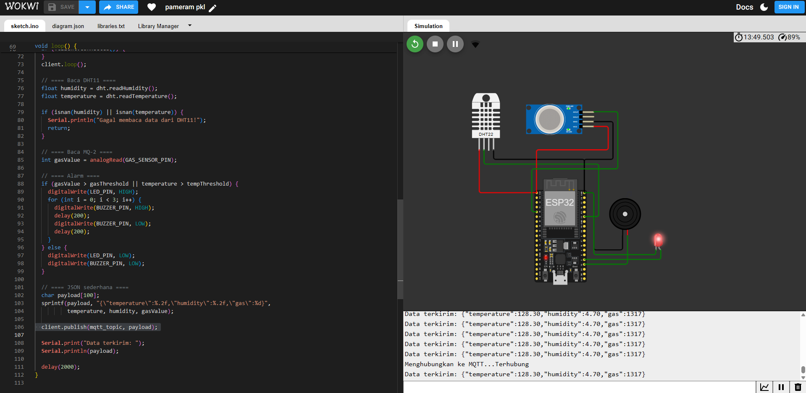
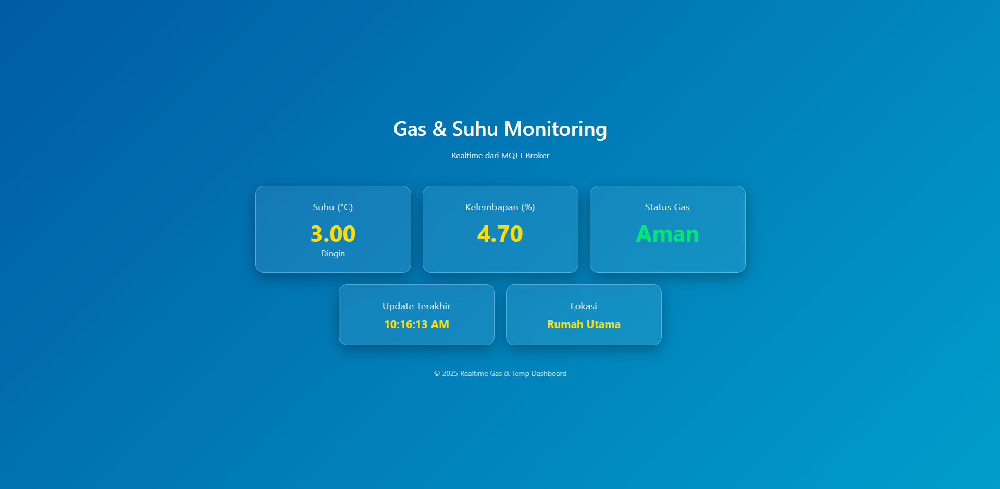

# 🌡️🔥 ESP32 Gas & Suhu Monitoring + MQTT + Web Dashboard

Proyek ini menggunakan **ESP32**, **sensor DHT11**, dan **sensor gas MQ-2** untuk memantau **suhu**, **kelembapan**, dan **kebocoran gas** secara **realtime**.  
Data dikirim ke **MQTT broker** dalam format JSON dan ditampilkan di **Web Dashboard interaktif** dengan desain modern.

---

## 📷 Preview Wokwi
  
> *Gambar rangkaian simulasi di Wokwi*

---

## 📍 Pinout ESP32

| Perangkat     | Pin ESP32 | Keterangan           |
|--------------|-----------|----------------------|
| DHT11        | GPIO 21   | Data suhu & kelembapan |
| MQ-2         | GPIO 34   | Input analog kadar gas |
| LED Indikator| GPIO 2    | LED nyala saat gas bocor |
| Buzzer       | GPIO 15   | Bunyi "bib-bib-bib" saat gas bocor |

---

## ✨ Fitur Utama
- **Realtime Monitoring** suhu, kelembapan, dan status gas.
- **Deteksi Gas Bocor** dengan LED & buzzer peringatan.
- **Pengiriman Data ke MQTT** dalam format JSON.
- **Web Dashboard Keren** dengan tema glassmorphism biru-kuning.
- **Histori Data** pada dashboard dengan fitur scroll & interaktif dropdown.

---

## 🚀 Cara Menjalankan di Wokwi

1. Buka [Wokwi Simulator](https://wokwi.com).
2. Unggah kode ESP32 berikut ke proyek Anda:
   - `main.ino` untuk ESP32.
   - Pastikan library **DHT sensor** sudah terpasang.
3. Sesuaikan konfigurasi MQTT broker di kode:
   ```cpp
   const char* mqtt_server = "test.mosquitto.org";
   const int mqtt_port = 1883;


4. Jalankan simulasi, pantau Serial Monitor untuk memastikan koneksi berhasil.


## 🌐 Web Dashboard



> Dashboard modern dengan tema glassmorphism, menampilkan data suhu, kelembapan, dan status gas secara realtime.

### Menjalankan Dashboard

1. Simpan file `index.html`, `style.css`, dan `script.js` di folder yang sama.
2. Buka `index.html` di browser.
3. Pastikan broker MQTT yang digunakan sama dengan di kode ESP32.

---

## 🗂️ Contoh Data MQTT

```json
{
  "temperature": 27.5,
  "humidity": 60.2,
  "gas": 1850
}
```

---

## 📌 Catatan

* Ambang batas gas default: **2000** (bisa disesuaikan di kode).
* Semua data dikirim ke topik: **`gas/rumah`**.
* Gunakan **MQTT over WebSocket** (`wss://` atau `ws://`) untuk Web Dashboard.

---
/